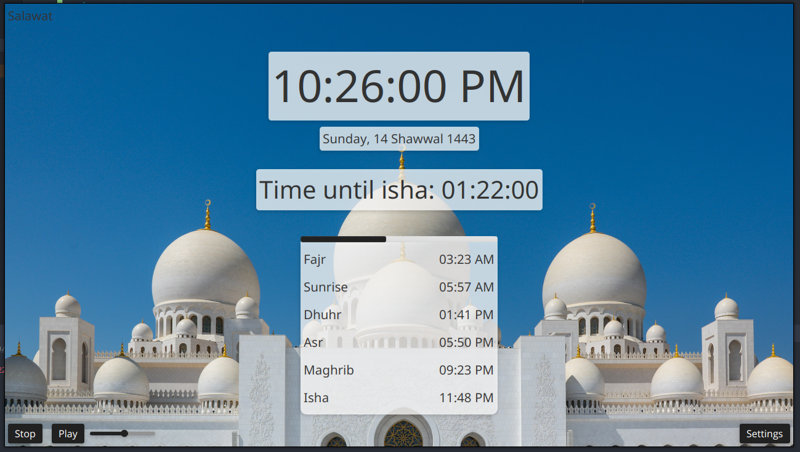
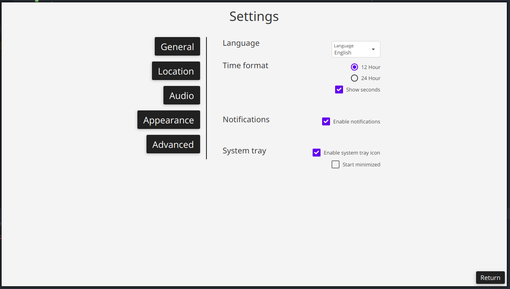

# Salawat

<!-- PROJECT LOGO -->
 

  

<h3 align="center">Salawat - صلوات</h3>

  

    A prayer times and Adhan application for Windows, macOS and GNU/Linux written in Java
     
    <a href="https://github.com/DBChoco/Salawat/releases/latest"><strong>Download »</strong></a>
     
     
    <a href="https://github.com/DBChoco/Salawat">View Demo</a>
    ·
    <a href="https://github.com/DBChoco/Salawat/issues">Report Bug</a>
    ·
    <a href="https://github.com/DBChoco/Salawat/issues">Request Feature</a>
  

  
  
  
  

   

  

<!-- ABOUT THE PROJECT -->
## About The Project

  

You might have used <a href="https://github.com/DBChoco/Muezzin">Muezzin</a> in the past, Muezzin is powerful and versatile but quite heavy especially for old or low-end machines.
That is why I've decided to write a brand-new application written entirely in Java. The main goal of the app is to make what Muezzin did (highly customizable and elegant prayer times app)
but more efficiently.

For now, if you have a powerful enough computer, I'd suggest you use Muezzin, because it's more stable.

On Salawat you can choose to play an Adhan or not, you can import your own audio file; you can also choose to have a background or not, and import your own.

  

<!-- SUPPORTED LANGUAGES -->
### Supported Languages
* English
* Français
* Español
* Arabic
* Turkish

### Built With

* [JavaFX](https://openjfx.io/)
* [MaterialFX](https://github.com/palexdev/MaterialFX)
* [adhan-ava](https://github.com/batoulapps/adhan-java)
* [FXTrayIcon](https://github.com/dustinkredmond/FXTrayIcon)

<!-- ROADMAP -->
### Roadmap

- [ ] Aur
- [ ] Fix bugs
  - [ ] Fix bug that causes crash after Adhan is played (need more information about the cause)
- [x] Weather
- [ ] Sunnah times
- [x] DateFormat
- [x] Make progress bar display audio progress
- [x] Make progress bar squared
- Calculation methods
  - [ ] Adjustements

See the [open issues](https://github.com/DBChoco/Salawat/issues) for a full list of proposed features (and known issues).

(<a href="#Salawat">back to top</a>)

<!-- How to install -->
## How to install

### Windows
From the  <a href="https://github.com/DBChoco/Salawat/releases/latest"><strong>download page</strong></a>, select the .EXE installer.
Download it and install it. 

You might receive a warning, that is because the app is not signed and I do not have the money to do so. The app is completely safe, you can read through the source code or have a trusted friend do it for you, all the code is <b>Open-Source</b>.

### GNU/Linux

I'm currently working on AUR support. (Snapstore and Flathub: "check")
In the meanwhile you can use the .DEB and TAR.GZ files as an alternative.

<!-- CONTRIBUTING -->
## Contributing

Contributions are what make the open source community such an amazing place to learn, inspire, and create. Any contributions you make are **greatly appreciated**.

If you have a suggestion that would make this better, please fork the repo and create a pull request. You can also simply open an issue with the tag "enhancement".

If you noticed a translation error or want to add a language yourself, feel free to contact me!

**Don't forget to give the project a star! Thanks again!**

<!-- LICENSE -->
## License

Distributed under the MIT License. See `LICENSE.txt` for more information.

<!-- CONTACT -->
## Contact

[Project Link](https://github.com/DBChoco/Salawat)

[Official Discord server](https://discord.gg/cpF9TTstN5)

Email: dbchoco.muezzin@gmail.com

<!-- ACKNOWLEDGMENTS -->
## Acknowledgments

* [Source of Adhan by Ahmad al-Nufais](https://www.youtube.com/watch?v=9k0wQtYu2nU)
* [Source of Mecca Adhan](https://www.youtube.com/watch?v=MaEzj5eRmjc&t)
* [Source of al-Aqsa Adhan](https://www.youtube.com/watch?v=z2xEwSi2vaI)
* [Source of Bismillah startup sound](https://www.youtube.com/c/FatihSeferagic/featured)
* [Template for the README page](https://github.com/othneildrew/Best-README-Template)

### Source of images
* [Light mode image by Nick Fewings](https://unsplash.com/photos/sfMW7-4NI-o)
* [Dark mode image by Katerina Kerdi](https://unsplash.com/photos/TAfqq1B3-2s)

(<a href="#Salawat">back to top</a>)

